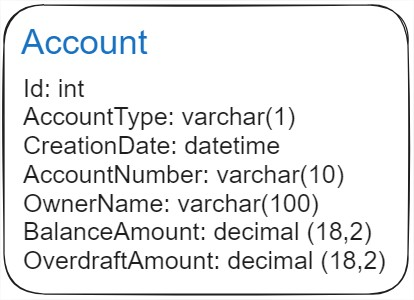
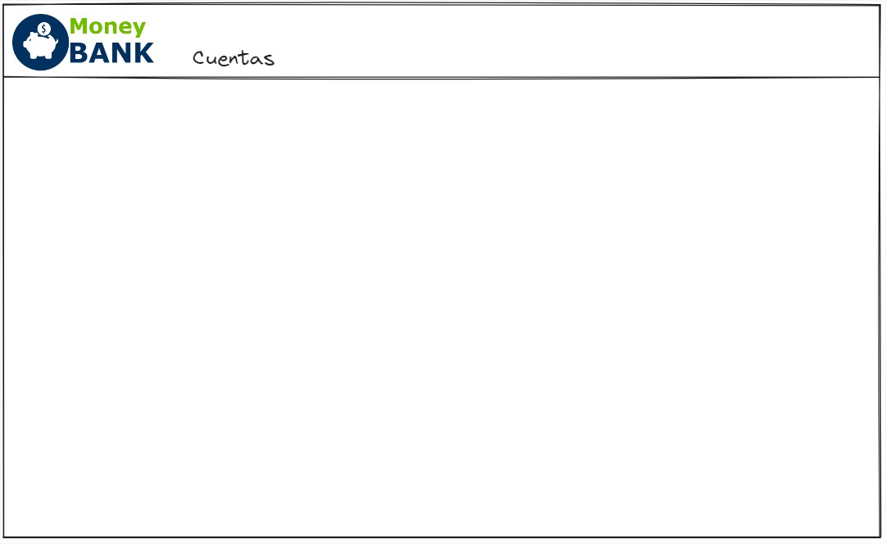
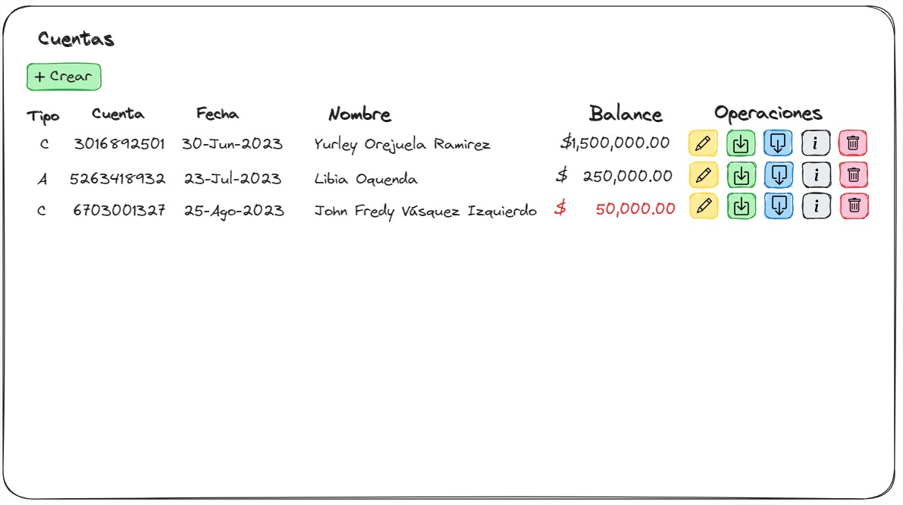
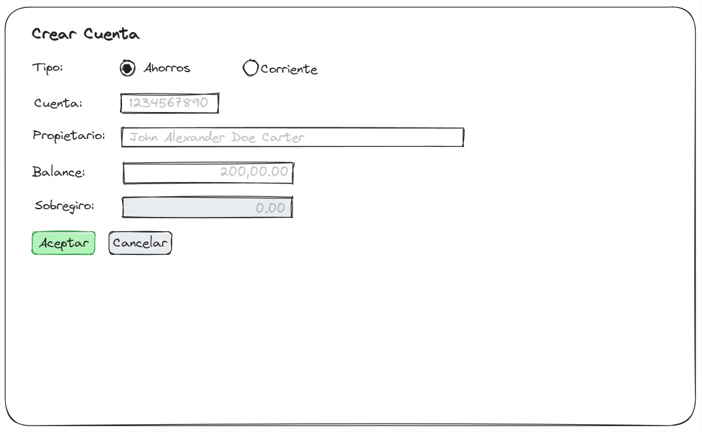
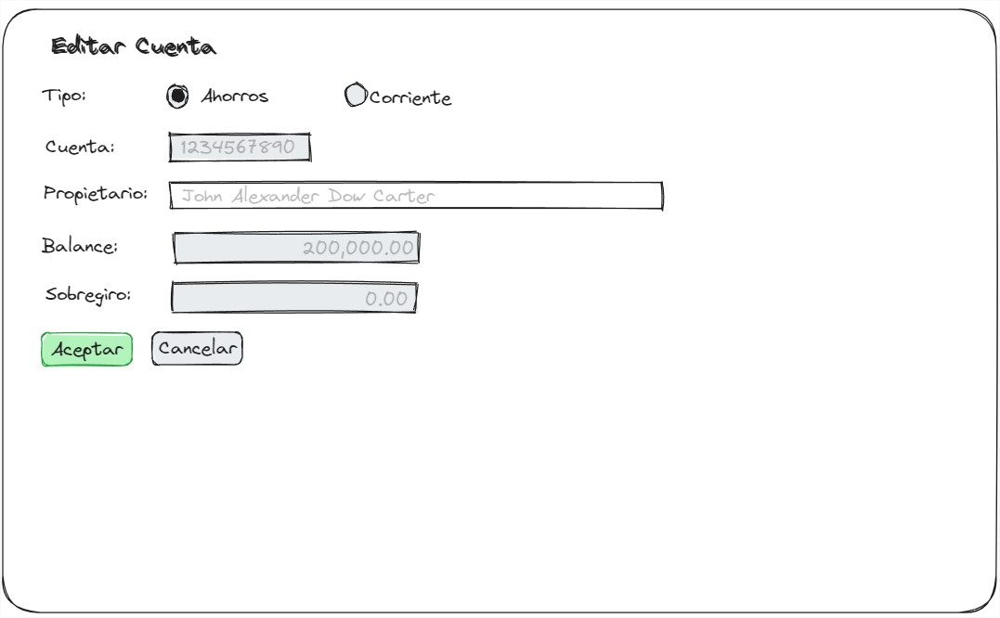
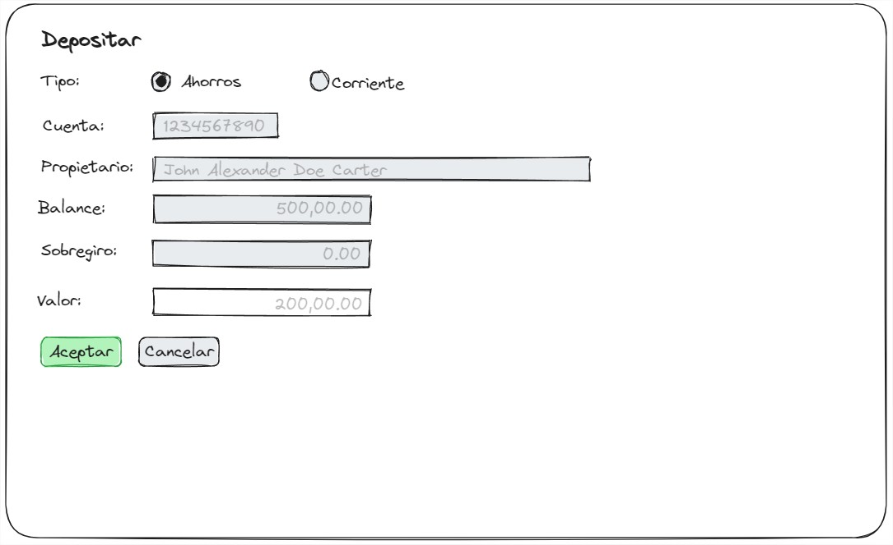
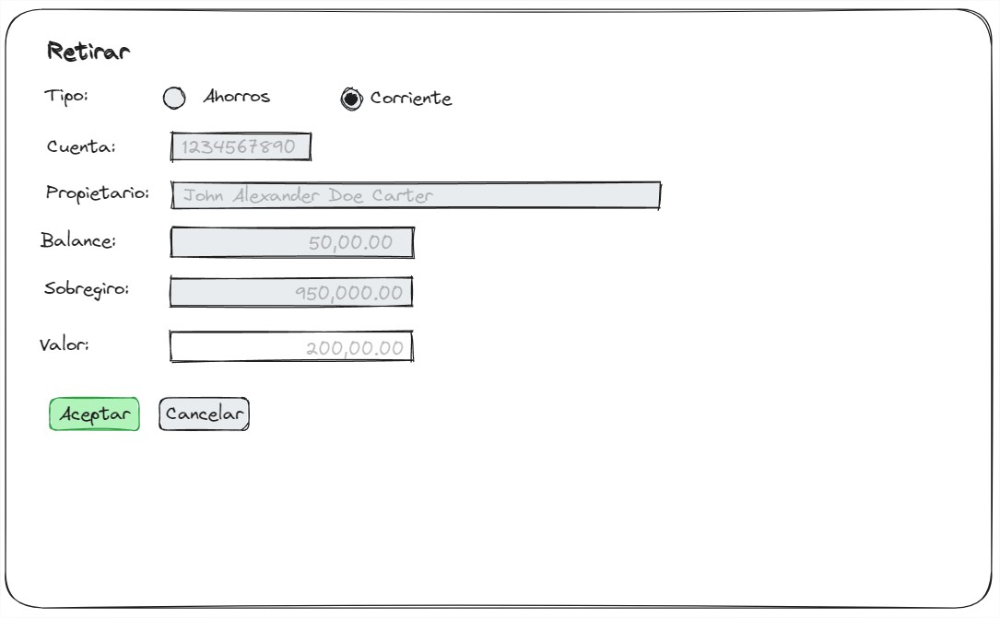
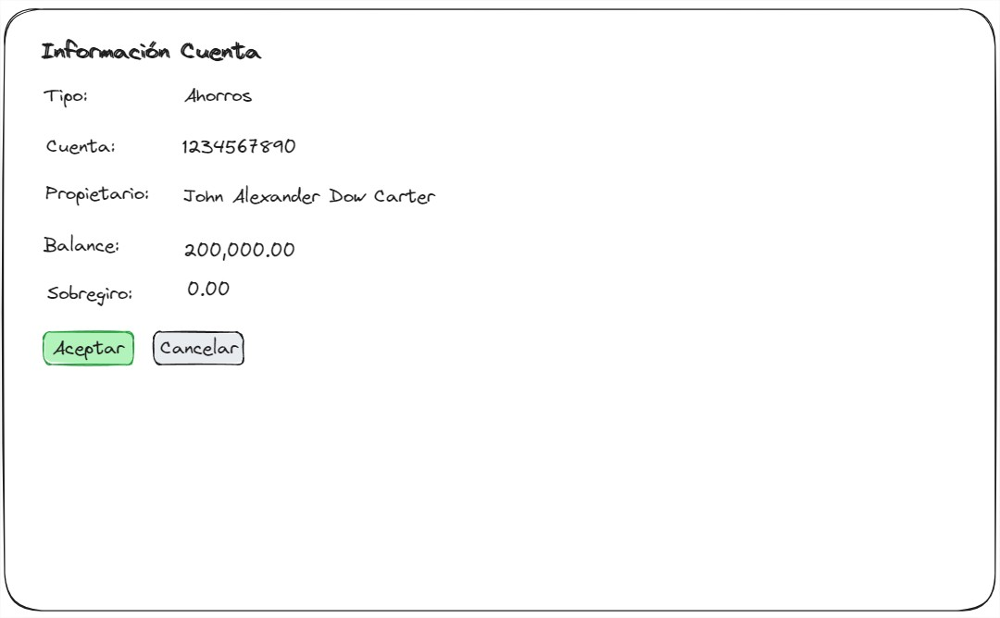
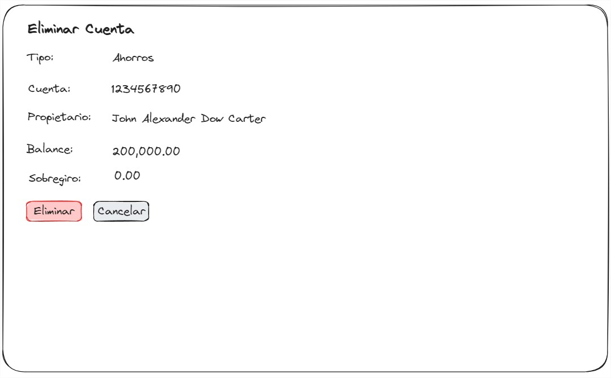

# Examen Tecnico
Implemente la aplicacion (MoneyBank) para Soportar operaciones sobre Cuentas Bancarias, simulando un cajero automatico.

Para ello tome utilice como base el proyecto **MoneyBankMVC** e implemente el codigo necesario par completar las fucionalidades

# Base de Datos
Utilizando el motor de Base de datos MySQL, ejecute los scripts de creacion de base de datos, creacion de usuario, creacion de tabla y el de insercion de datos para preparar el ambiente inicial de su proyecto.

## Scripts
- 01_Create_Database.sql
- 02_Create_User.sql
- 03_TAB_Accounts.sql
- 04_INS_Acounts.sql

# Modelo
Basandose en la tabla de Account y la descripcion de esta cree el Modelo Necesario para relizar las operaciones dentro de MVC que supla las acciones basicas de adminitracion de los datos (CRUD)




Tenga en cuenta las Anotaciones Necesarias para manejar los conceptos de :
- Llave ([Key])
- Requeridos (ej. El Campo Nombre del Propietario es Requerido)
- Longitud (ej. El campo Numero de La Cuenta tiene una longitud maxima de 10 caracteres)
- Valores (ej. El Campo Numero de la Cuentas Solo Acepta Numeros)
- Lista de Datos (ej. El campo Tipo de Cuenta solo permite (A o C))
- Tipos ([Date])


## Operaciones
Las siguientes son las operaciones que se pueden realizar con las cuentas:
- Listar
- Crear
- Editar
- Depositar
- Retirar
- Informacion
- Eliminar

### Menu
El Sistema debe tener un menu principal con el logo de la aplicacion (MoneyBankLogo.png) y la Opcion Cuentas.




### Listar Cuentas
Al Seleccionar la Opción de Cuentas se despliega la lista de Cuentas con las opciones principales.





### Crear Cuenta
Al Crear un cuenta se pediran los campos necesarios, como el tipo de cuenta (Ahorros o Corriente), el propietario de la cuenta, y- El Balance inicial con el que se apertura la cuenta.
 



### Editar Cuenta
Al Editar la cuenta el unico valor que se podra modificar sera el Nombre del propietario de la cuenta.





### Depositar
Al depositar un valor a la cuenta se desplegaran los campos necesarios en modo de solo lectura y se pedira el valor a depositar.





### Retirar
Al depositar un valor a la cuenta se desplegaran los campos necesarios en modo de solo lectura y se pedira el valor a retirar.





### Informacion Cuenta
Al mostrar la informacion de la cuenta se desplegaran todos los campos pero de manera informativa, sin pertimitir editar.





### Eliminar Cuenta
Al Seleccionar eliminar cuenta se desplegaran los datos de modo informativo, y al selecionar la opcion Eliminar, se debe mostrar una ventana de confirmacion para garantizar qe se elimina el registro o no.





# Consideraciones
- Al listar las cuentas, el valor del Balance debe mostrarse en Rojo si el valor de sobregiro es mayor a cero
- Al Crear la Cuenta debe validar los campos requeridos, tipos y longitudes ademas que debe validar que el Balance debe ser Mayor a Cero para aperturar la Cuenta
- El Valor Maximo de Sobregiro (MAX_OVERDRAFT) es de $1,000,000.00 (Un Millon)
- Al Crear una Cuenta de Ahorros el Valor del Balance es igual al valor inicial de la apertura
- Al Crear una cuenta Corriente, El valor del Balance inicial, es igual al Valor Ingresado mas el Valor Maximo de sobregiro, Por ejemplo si apertura una cuenta con un valor de $500,000.00 al crear la cuenta esta se crea sumandole el Monto Maximo de sobregiro, quedando entonces con un Valor Inicial de $1,500,000.00
- Al Realizar un Deposito y la cuenta es de Ahorros, el Valor del Balance se incrementa en el valor Depositado
- Al realizar un Deposito y la cuenta es Corriente, el Valor del Balance es igual al Valor valor actal mas el valor depositado y si el sobregiro es mayor a cero y el balance actualizado es menor que el MAX_OVERDRAFT, entonce el valor del sobregiro se actualiza con la diferencia del MAX_OVERDRAFT y el BAlance actualizado.
- Debe mostrar el Mensaje de Fondos Insificientes sial momento de retirar el valor de Retiro es superior al Valor actual del Balance

# Ejemplos
A continuacion mostraremos algunos ejemplos de la Logica de Deposito y Retiro para los tipos de cuentas.

## Cuenta de Ahorros / Deposito

Balance Actual = $200,000.00
Sobregiro= $0.00

Deposito =  $500,000.00

Nuevo Balance = $700,000.00
Sobregiro = $0.00

#### Regla
```csharp
Balance += Deposit
```


### Cuenta de Ahorros / Retiro

Balance Actual = $700,000.00
Sobregiro= $0.00

Retiro =  $300,000.00

Nuevo Balance = $400,000.00
Sobregiro = $0.00

#### Regla
```csharp
if (Withdrawal <= Balance) 
{
    Balance -= Withdrawal
}
else 
{
    "Fondos Insuficientes"
}
```


### Cuenta Corriente / Deposito

Balance Actual = $300,000.00
Sobregiro= $700,000.00

Deposito =  $500,000.00

Nuevo Balance = $800,000.00
Sobregiro = $200,000.00


#### Regla

```csharp
Balance += Deposit

if ( Overdraft > 0 && Balance < MAX_OVERDRAFT)
{
    OverDraft = MAX_OVERDRAFT - Balance
}
else 
{
    OverDraft = 0
}
```

### Cuenta Corriente / Retiro

Balance Actual = $800,000.00
Sobregiro= $200,000.00

Retiro =  $500,000.00

Nuevo Balance = $300,000.00
Sobregiro = $200,000.00

#### Reglas

```csharp
if (Withdrawal <= Balance) 
{
    Balance -= Withdrawal

    if( Overdraft > 0 && Balance < MAX_OVERDRAFT)
    {
        OverDraft = MAX_OVERDRAFT - Balance
    }
}
else 
{
    "Fondos Insuficientes"
}
```


# Condiciones
- Codigo MVC debe quedar Cero errores y Cero Warnings
- Si Su asignacion fue usar Entity Framework, la logica de acceso a base de datos se debe implementar dentro del servicio y no dentro del controlador
- Si su asignacion fue usar API, puede utilizar FastAPI para completar la API llamada MoneyBankAPI con el codigo Necesario para Ejeutar las operaciones de acceso a base de datos y en la logica de servicios del proyecto MVC debe realizar el llamado a esta API  mediante el uso de componente RestSharp.